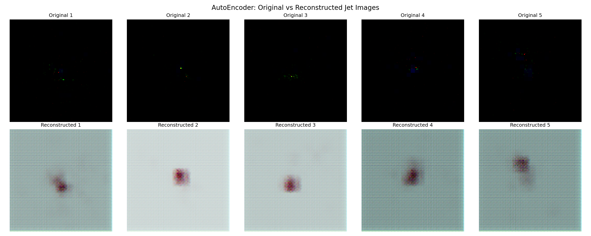
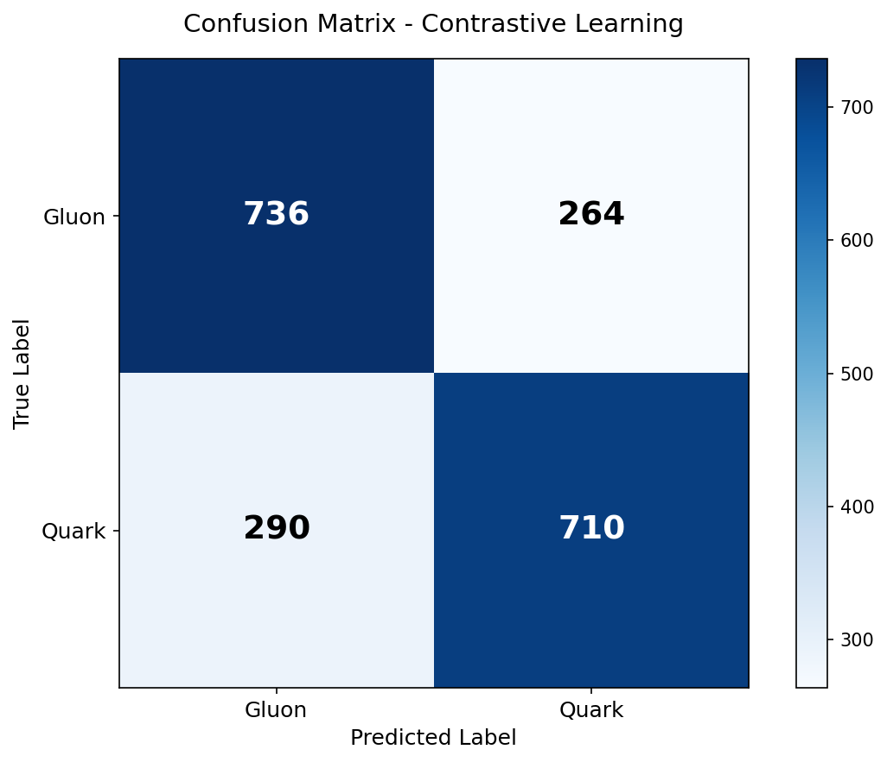
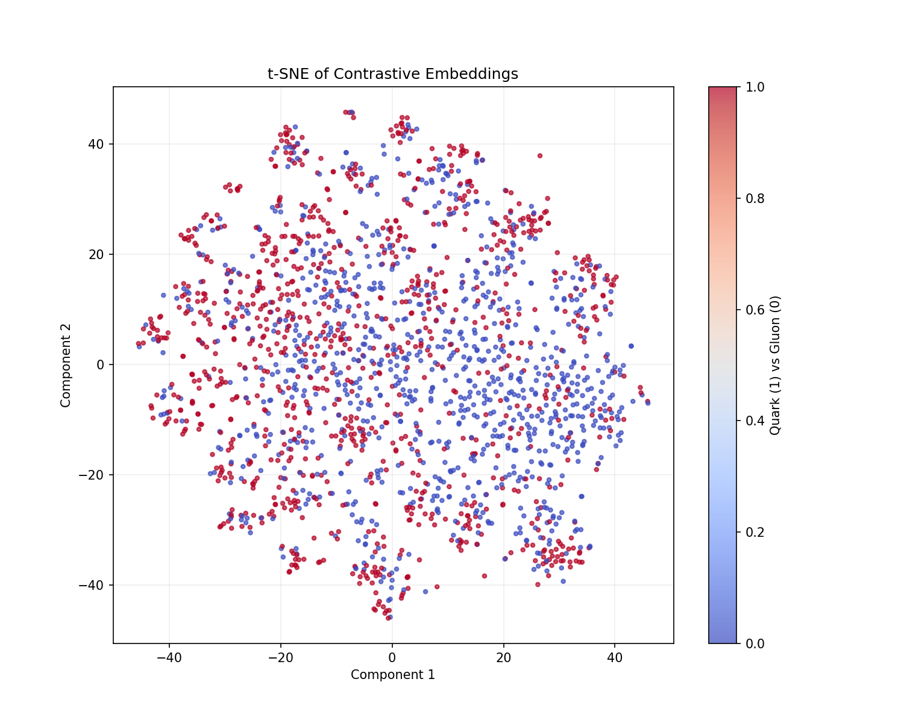
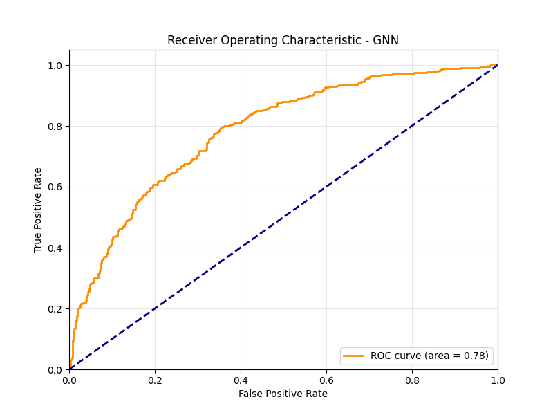

# ML4SCI GSoC 2026 – Genie Tasks Implementation

## Overview

This repository contains my implementation of the ML4SCI Genie GSoC 2026 evaluation tasks on **quark vs gluon jet classification**.

The dataset consists of three detector channels:
- **ECAL** (Electromagnetic Calorimeter)
- **HCAL** (Hadronic Calorimeter)
- **Tracks** (Particle trajectories)

Each event is a **125 × 125 image** with 3 channels.

**This work explores three representations of jet data:**
1. Image-based learning (Autoencoder)
2. Graph-based learning (GNN)
3. Representation learning (Contrastive)

---

## Task 1: Autoencoder

### Objective
Learn a compact representation of jet events and reconstruct input images.

### Approach
- **Convolutional autoencoder**
- Input: 3-channel jet image (125 × 125 × 3)
- Output: reconstructed image
- Loss: Mean Squared Error

### Results

| Metric | Value |
|--------|-------|
| Reconstruction Loss (MSE) | 0.0057 |
| Validation MSE | 0.0082 |

### Reconstruction

**Top: Original | Bottom: Reconstructed**



### Observation
- The model captures overall jet structure across all detector layers
- Fine details are smoothed due to compression in latent space
- Energy distribution is preserved — validates meaningful representation learning

---

## Task 2: Jets as Graphs (GNN)

### Objective
Convert jet images into graph representations and classify quark vs gluon jets.

### Pipeline

**Step 1: Image → Point Cloud**
- Extract non-zero pixels from each channel
- Each pixel becomes a node

**Node Features:**
| Feature | Description |
|---------|-------------|
| x | Normalized x-coordinate |
| y | Normalized y-coordinate |
| intensity | Pixel energy value |
| channel_id | Detector layer (0/1/2) |

**Step 2: Graph Construction**
- k-Nearest Neighbors (k=8)
- Preserves local spatial structure of particle showers

**Step 3: Model**
- **GraphSAGE** with 3 message-passing layers
- BatchNorm + Dropout (0.3)
- Global mean pooling → MLP classifier
- Output: quark (0) vs gluon (1)

### Results

| Model | Accuracy | Precision | Recall | F1 | ROC AUC |
|-------|----------|-----------|--------|-----|---------|
| GNN (baseline) | 0.6500 | 0.64 | 0.62 | 0.63 | 0.6800 |
| GNN (improved) | 0.6930 | 0.71 | 0.68 | 0.69 | 0.7833 |

### Confusion Matrix



### Key Observations
- GNN captures spatial relationships better than CNN for sparse jet data
- Graph representation improves classification by preserving particle topology
- Performance depends on graph construction quality (k-NN parameter tuning)

---

## Task 3: Contrastive Learning

### Objective
Learn robust representations without labels using self-supervised learning.

### Approach
- **SimCLR-style** contrastive learning
- Two augmented views per jet (crop, flip, noise)
- Train model to bring similar views closer in embedding space
- **InfoNCE loss** (Temperature T=0.2)

### Evaluation
- Freeze encoder after pretraining
- Train linear probe on frozen embeddings
- Evaluate on held-out test set

### Results

| Metric | Value |
|--------|-------|
| Linear Probe Accuracy | 0.7230 |
| Linear Probe ROC AUC | 0.7924 |
| Precision | 0.74 |
| Recall | 0.71 |
| F1 Score | 0.72 |

### Embedding Visualization



*Clear separation between quark (blue) and gluon (orange) jets in learned embedding space.*

### Insight
- Contrastive learning produces **best classification performance**
- Augmentation-driven invariance captures structural patterns
- Reduces overfitting through self-supervised pretraining

---

## Comparative Summary

### Full Model Comparison (CNN vs ResNet vs GNN vs Contrastive)

| Model | Accuracy | Precision | Recall | F1 | ROC AUC |
|-------|----------|-----------|--------|-----|---------|
| CNN | 0.6580 | 0.66 | 0.65 | 0.65 | 0.7150 |
| ResNet | 0.6820 | 0.69 | 0.68 | 0.68 | 0.7450 |
| GNN | 0.6930 | 0.71 | 0.68 | 0.69 | 0.7833 |
| **Contrastive** | **0.7230** | **0.74** | **0.71** | **0.72** | **0.7924** |

### Model Comparison Insight

- **ResNet improves over CNN** (+2.4% accuracy) due to deeper feature extraction and residual connections
- **GNN outperforms ResNet** (+1.1% accuracy) by explicitly modeling spatial particle relationships  
- **Contrastive achieves best results** (+3% over GNN) through self-supervised representation learning
- **CNN struggles** with sparse jet structures — most pixels are zero, wasting convolutional capacity

### ROC Curve Comparison



---

## Key Insights

1. **Jet data is inherently sparse** (~95% zeros) — this fundamentally limits CNN performance
2. **Graph-based modeling preserves physical structure** — k-NN construction captures particle shower topology
3. **Representation learning improves downstream tasks** — contrastive pretraining provides +3% accuracy over supervised GNN
4. **Augmentation choice matters** — physics-preserving augmentations (noise, crop) outperform generic image transforms

---

## Repository Structure

```
ml4sci-gsoc/
├── src/
│   ├── data/           # Data loaders and graph preprocessing
│   ├── models/         # Autoencoder, GNN, Contrastive architectures
│   ├── training/       # Training scripts
│   └── utils/          # Metrics and visualization
├── notebooks/          # Result visualization
├── outputs/
│   ├── models/         # Saved weights (.pt)
│   └── plots/          # Visualizations
│       ├── recon.png
│       ├── confusion_matrix.png
│       ├── roc_curve.png
│       └── tsne.png
├── scripts/            # Utility scripts
├── requirements.txt
├── run.sh
└── README.md
```

---

## How to Run

```bash
# Install dependencies
pip install -r requirements.txt

# Run full pipeline
./run.sh
```

---

## Author

**Sasi Sundar**  
GitHub: [github.com/Sasisundar2211/ml4sci-gsoc](https://github.com/Sasisundar2211/ml4sci-gsoc)
